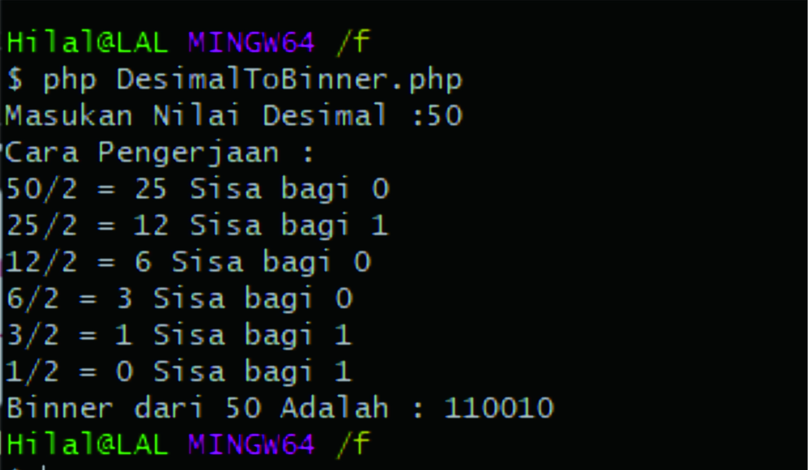

## cli-binary-to-decimal
Convert binary to decimal with step

## Usage

```
$ git clone https://github.com/mohalhilal/cli-desimal-to-binner.git
$ cd cli-desimal-to-binner
$ ls
$ php DesimalToBinner.php
```



